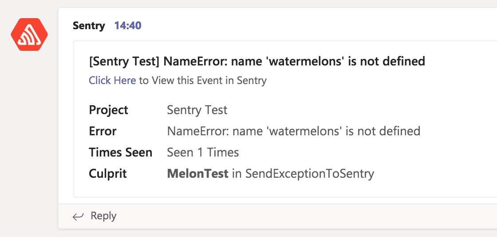
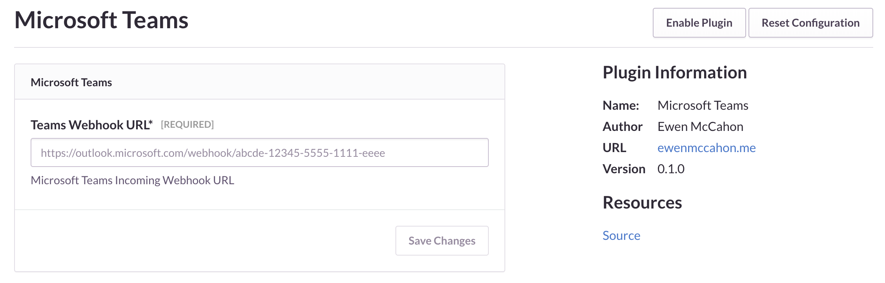

# Microsoft Teams Plugin for Sentry

Microsoft Teams Integration for [Sentry Error Tracking Software](https://sentry.io/welcome/).



Based off the [Sentry Plugins](https://github.com/getsentry/sentry-plugins) written by the Sentry Team. Thanks for the excellent tool guys!

## Installation Instructions

In your `requirements.txt` file, add the below URL to install the MS Teams Plugin.

```
https://github.com/Neko-Design/sentry-msteams/archive/master.zip
```

For local development you can install using the below command:

```
pip install https://github.com/Neko-Design/sentry-msteams/archive/master.zip
```

## Configuration

In your project, locate the Integrations management screen and click 'Configure Plugin' below the 'Microsoft Teams' item.



There is only one configuration option at the moment, the WebHook URL to send messages to. Create a new Incoming Webhook in Microsoft Teams and paste the URL into the configuration screen, then click 'Save Changes'.

When ready, click 'Test Plugin' to generate an exception and send a message to your chosen WebHook URL.
